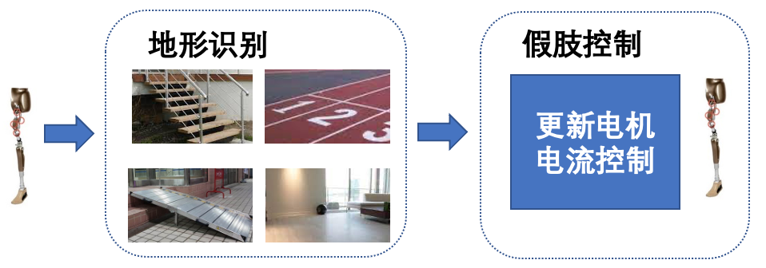
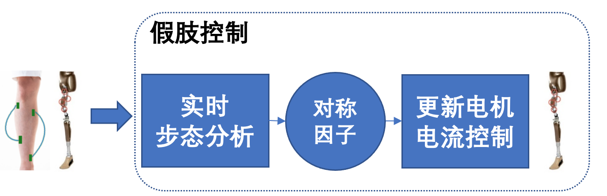
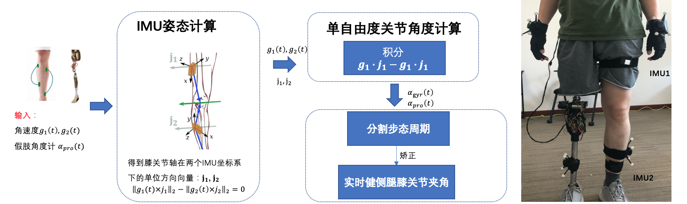
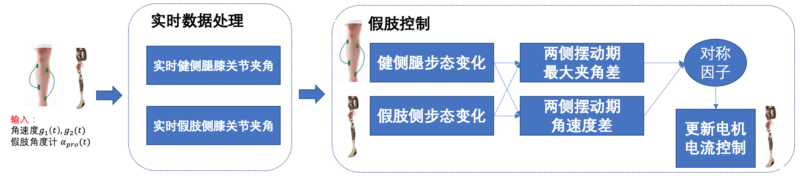

# 基于步态对称性的智能假肢控制方法

# 研究背景

## 传统假肢控制策略 

目前主动假肢控制策略主要分为两步。第一步，通过假肢上配置的多种传感器进行地形识别。第二步，根据地形识别结果，更新假肢上电机的电流控制。

因此，当前下肢假肢设计与患者适配过程中的两大难题：

1. 数据收集难：当前假肢控制程序开发与适配需患者佩戴假肢在多地形下的大量行走数据，数据获取难度大、周期长; 
2. 地形适配难：当前假肢控制程序需基于地形设定控制参数，可识别地形有限且识别错误后果严重。

## 对称性假肢控制策略

针对传统主动假肢的存在的难题，我们提出基于运动对称性的假肢控制策略，在优化步态的同时避免地形识别，使假肢适用于开放地形。

基于步态对称性，我们利用健侧腿的步态来拟合假肢侧的运动，进而更新电机上的电流控制，摆脱传统算法对于地形的依赖。

# 研究内容

本项目的研究内容主要分为两部分，无需校准的膝关节角度测量与基于步态对称性的假肢控制方法。

## 无需校准的膝关节角度测量

首先，分别将两个IMU通过绑带固定到单侧大腿截肢患者健侧大腿和小腿上。 IMU的位置和方向都是完全未知的，不假设任何IMU局部传感器坐标轴与膝关节轴或骨骼轴重合。因此，此时膝关节弯曲、伸展的方向都是未知的。我们利用运动学约束来计算得到关节轴在两个IMU局部坐标系方首先，收集数据，同时让患者健侧腿自由运动（即不假设任何特定类型的运动）。

我们在局部坐标系表示的膝关节轴方向的单位向量$j_1,j_2$，通过约束$||g_1(t)\times j_1||_2-||g_2(t)\times j_2||_2=0,\forall t$来近似计算陀螺仪的关节角速度。然后，我们通过对绕关节轴的角速率差进行积分得到膝关节的屈膝、伸展角度。

## 基于步态对称性的假肢控制方法

本项目将膝关节计算的算法实现在假肢片上（STM32F407微处理器，Cortex-M4内核），从而提升了计算的实时性。

我们在用户健侧腿的大腿和小腿上放置两个IMU模块，在假肢片上进行实时步态分析。通过实时步态分析，计算对称性因子。进而实时更新电机上的电流控制。

# 文档说明

<pre>
│  bvh.py
│  config.py
│  get_position.py
│  JointAngel.py
│  main.c
│  dataAnalysis.py
</pre>

### main.c

假肢片上运行代码，进行实时步态分析与更新电机电流控制

### bvh.py, get_position.py

用于分析转换bvh数据

### JointAngle.py, config.py

计算膝关节夹角代码

### dataAnalysis.py

用于数据分析
